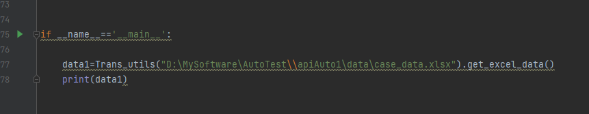

# apiAuto
## 接口自动化

### 一、目录文件说明 
common---存放公共类，如数据库连接、http接口封装、断言封装 

config

    global_config.py--存放环境域名，当前用TEST_HOST来做测试，后面应该用一个变量来切换各环境
data--用例管理

logs--存放日志

reports--存放测试报告 

    report_html--该目录下为生成的测试报告
    temps--存放临时测试数据

testcase

    conftest.py--用例前置，如登录
    test_case.py--执行用例

utils--工具类

    read_jsonfille_utils.py--读取json文件中的用例，在test_case.py运行前需读取到用例    
    excel_trans_json.py--将excel文件转化为同名json文件，存放到data/case_json目录下（后面要集成，现在只能先改路径进行文件转化）

    

main.py--执行用例，生成测试报告

pytest.ini--配置文件

requirements.txt--框架内所需库

### 使用步骤
一、安装库
运行requirements.txt

二、使用utils/read_jsonfile_utils.py将excel文件中的用例转化为json文件，
转化后的json文件放在data中的case_json目录

三、运行main.py

